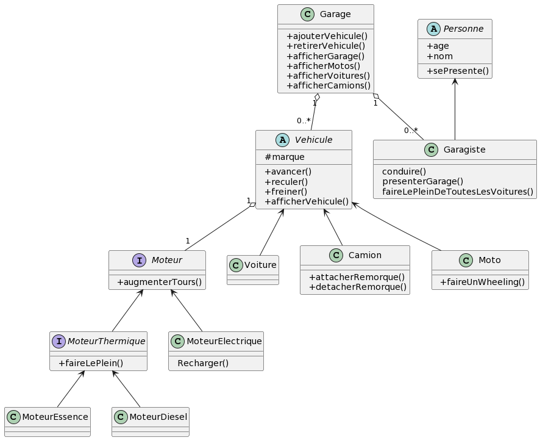

# TP Garage
## Instructions 
Réalisez l'exercice suivant à partir du diagramme fourni.
En ce qui concerne la plupart des méthodes (avancer, reculer etc), un simple console.log suffit. 

## Diagramme
